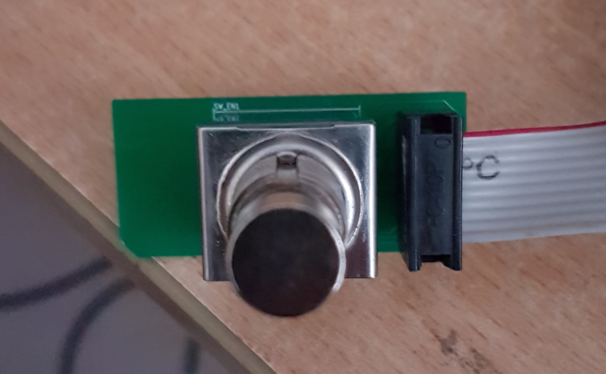
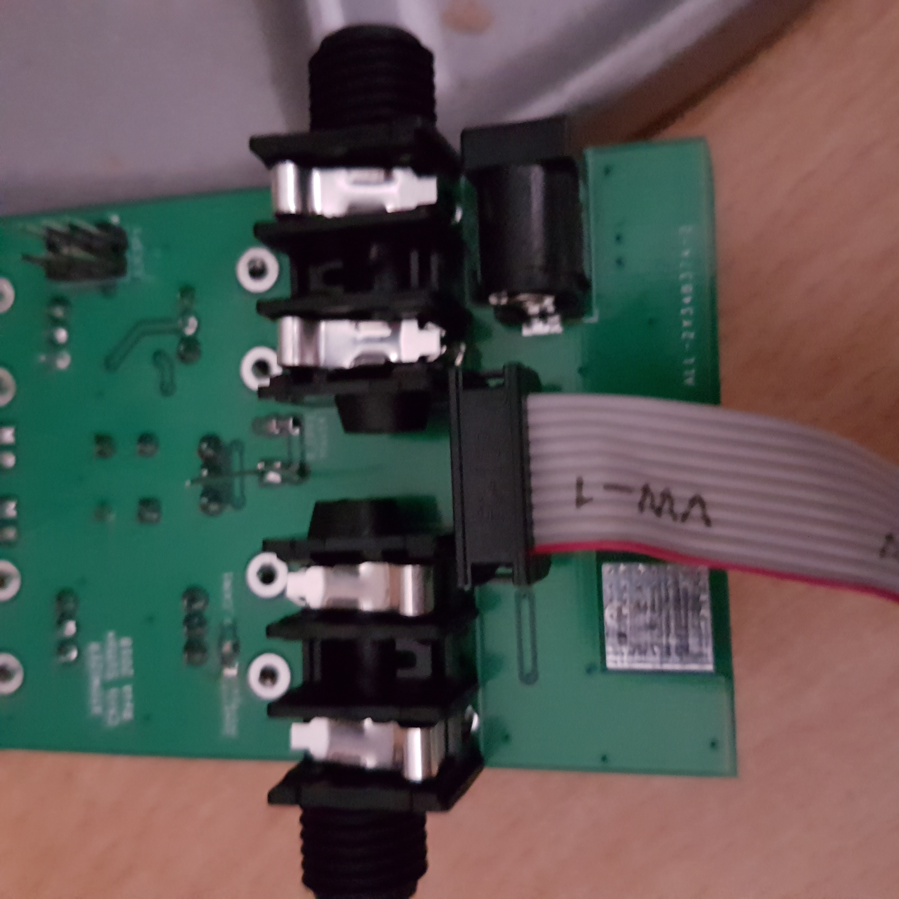

## Assembly Instructions

- Solder the power supply components first including the DC barrel jack. 
- Test the 9VDC at the barrel jack is outputing +/-5VDC at R2 and R4 respectively.
- Continue with the rest:
  - Solder the other 0805 resistors and capacitors
  - Solder the SOD123 diodes
  - Solder the remaining IC parts: ATTINY mcu, TLo72 opamp and optocoupler
  - Solder the remaining aluminum caps
  - Solder the pin headers.
  - Solder the through parts: sockets, pots, switches, buttons etc..

## firmware test instructions

This uses Atmel ICE to download the firmware to the target. 

### Connect the PCB

- Connect the assembled footswitch PCB to the assembled main PCB using 2x5 IDC ribbon cable. 
Note the orientation of the cable.

<centre>
  
|Footswitch PCB (top view)| Main PCB (bottom view) |
|:-----------------------:|:----------------------:|
|  |  |

</centre>

- Connect the DC jack on the assembled main PCB to a power source (pref. lab supply). 
- Switch on power source.

### Connect the Atmel ICE

- Plug the USB cable to the Atmel ICE and your PC. The red light should be lit.
- Plug the Atmel ICE ICSP cable from the Atmel ICE to the back of the assembled PCB. 
The white dot on the PCB indicates the clock side (the ICE cable has a bump on the clock side)
-  Press the foot switch if the ICE green led is not lit.

### Open Atmel Studio

- Open the project in atmel studio 7
- Go to the Tools menu > Device Programming. 
- Select the device (ATINY85) press Apply and the read. The device signature field should read a value.
- Close the window. 
- Go to Debug menu > Start without debugging to download to the target. 
