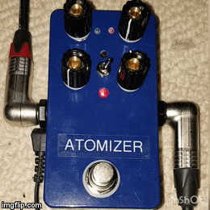

### Atomizer Tremolo Pedal

## Features

- Adjustable mix and output gain
- Lowest clock speed 2Hz
- Square and Triangle waveform
- Normal, Skew and Sweep modes
- True bypass

## Power Requirements

9VDC, center negative, 30mA

## Sound files

TODO

