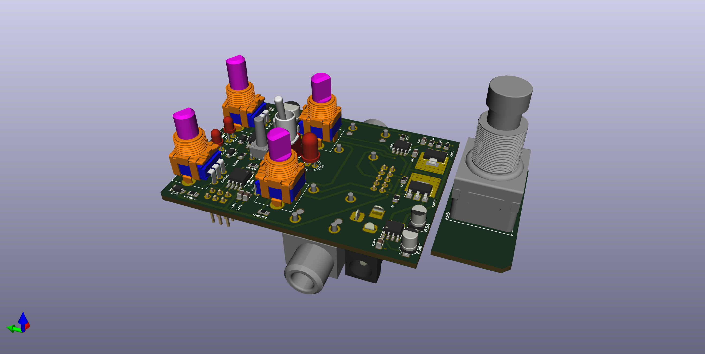

### Atomizer Tremolo Pedal

## Features

- Adjustable mix and output gain
- Lowest clock speed 2Hz
- Square and Triangle waveform
- Normal, Skew and Sweep modes
- True bypass

## BOM

| Customer No | Description | Mouser No | Mfr. No | Manufacturer | RoHS | Order Qty. |
|:------------:|-----------------------------------------------------------------------------------------------------------------------------------------------|:--------------------:|:--------------------:|:--------------------:|:---------------------------:|:----------:|
| C_BP2 | Multilayer Ceramic Capacitors MLCC - SMD/SMT 0805 10uF 16volts *Derate Voltage/Temp | 81-GRM21BC81C106KE5K | GRM21BC81C106KE15K | Murata | RoHS Compliant | 1 |
| C_BP3 | Multilayer Ceramic Capacitors MLCC - SMD/SMT WCAP-CSGP 0.1uF 0805 10% 50V MLCC | 710-885012207098 | 8.85012E+11 | Wurth Electronics | RoHS Compliant | 4 |
| CP_FAST1 | Aluminium Organic Polymer Capacitors WCAP-PSLP 10V 22uF 20% ESR=45mOhms | 710-875105240003 | 8.75105E+11 | Wurth Electronics | RoHS Compliant | 1 |
| CP_INV2 | Aluminium Electrolytic Capacitors - SMD 16 Volts 10uF 20% 4x5.3 | 140-VE100M1CTR0405 | VE-100M1CTR-0405 | Lelon | RoHS Compliant | 2 |
| CP_SLOW1 | Aluminium Electrolytic Capacitors - SMD 220UF 16V ELECT FP SMD | 667-EEE-FPC221XAP | EEE-FPC221XAP | Panasonic | RoHS Compliant | 1 |
| D_LED1 | Standard LEDs - Through Hole Red Transparent | 859-LTL-307EE | LTL-307EE | Lite-On | RoHS Compliant | 1 |
| D_LEDLO1 | Standard LEDs - Through Hole Blue Oval | 941-C4SMABGFCR2T3451 | C4SMA-BGF-CR2T3451 | Cree, Inc. | RoHS Compliant | 2 |
| D_LO2 | Diodes - General Purpose, Power, Switching Switching diode 400 mW | 821-1N914BWRH | 1N914BW RH | Taiwan Semiconductor | RoHS Compliant | 6 |
| J_ICSP1 | Headers & Wire Housings 2.54MM HDR VT 6P 295/120 SN | 538-22-28-4062 | 22-28-4062 | Molex | RoHS Compliant | 1 |
| J_MAINTOAUX1 | Headers & Wire Housings 2.54MM HDR VT 10P 295/120 SN | 538-22-28-4102 | 22-28-4102 | Molex | RoHS Compliant | 2 |
| J_OUT1 | Phone Connectors W/CHASSIS GROUND | 550-10284G | NRJ4HF-1 | Neutrik | RoHS Compliant | 2 |
| J_PWR1 | DC Power Connectors RT ANGL PWK JK PIN D | 502-RAPC722X | RAPC722X | Switchcraft | RoHS Compliant | 1 |
| P_DEPTH1 | Potentiometers 50K VERTICAL | 688-RK09L1140A5P | RK09L1140A5P | ALPS | RoHS Compliant | 1 |
| P_VOL1 | Potentiometers 10 KOhms 20% | 688-RK09L1140A66 | RK09L1140A66 | ALPS | RoHS Compliant | 3 |
| R_GAIN1 | Thick Film Resistors - SMD CRGCQ 0805 2K7 1% SMD Resistor | 279-CRGCQ0805F2K7 | CRGCQ0805F2K7 | TE Connectivity | RoHS Compliant | 1 |
| R_MLED1 | Thick Film Resistors - SMD 0805 22Kohms 1% AEC-Q200 | 667-ERJ-6ENF2202V | ERJ-6ENF2202V | Panasonic | RoHS Compliant By Exemption | 1 |
| R_PD1 | Current Sense Resistors - SMD 0805 .022ohm 1% AEC-Q200 | 755-UCR10EVHFSR022 | UCR10EVHFSR022 | ROHM Semiconductor | RoHS Compliant | 1 |
| R1 | Thick Film Resistors - SMD CRGP 0805 1K0 1% SMD Resistor | 279-CRGP0805F1K0 | CRGP0805F1K0 | TE Connectivity | RoHS Compliant | 6 |
| R2 | Thick Film Resistors - SMD 1/8Watt 330ohms 1% Commercial Use | 71-CRCW0805330RFKEAC | CRCW0805330RFKEAC | Vishay | RoHS Compliant By Exemption | 1 |
| R4 | Thick Film Resistors - SMD 0805 270ohms 1% AEC-Q200 | 667-ERJ-6ENF2700V | ERJ-6ENF2700V | Panasonic | RoHS Compliant By Exemption | 1 |
| R5 | Thick Film Resistors - SMD 0805 47.0ohms 1% Tol AEC-Q200 | 667-ERJ-6ENF47R0V | ERJ-6ENF47R0V | Panasonic | RoHS Compliant By Exemption | 1 |
| SW_ATTACK1 | Toggle Switches SPDT ON-ON PC MOUNT | 108-2MS1T1B1M2QE-EVX | 108-2MS1T1B1M2QE-EVX | Mountain Switch | RoHS Compliant By Exemption | 1 |
| SW_EN1 | Pushbutton Switches High Actuation Foot Switch 10mm dia Actuator, 11.5mm Bushing, 1A 9VDC, 3 Pole, 3000gf, Alternate Action / Maintained, PCB | 612-FS573PLT2B2M2QE | FS57003PLT2B2M2QE | E-Switch | RoHS Compliant | 1 |
| SW_MODE1 | Tactile Switches 6MM ACTHIGH TEMP TACT SWITCH | 506-1-1825910-4 | 1-1825910-4 | TE Connectivity | RoHS Compliant | 1 |
| U_BUF1 | Operational Amplifiers - Op Amps JFET INPUT OP AMP LOW NOISE | 621-TL072SG-13 | TL072SG-13 | Diodes Incorporated | RoHS Compliant | 1 |
| U_CLK1 | 8-bit Microcontrollers - MCU AVR 8K FLSH 512B EE 512B SRAM ADC 5V | 556-ATTINY85-20SU | ATTINY85-20SU | Microchip | RoHS Compliant | 1 |
| U_INV1 | Switching Voltage Regulators High Voltage | 579-TC7660SEOA713 | TC7660SEOA713 | Microchip | RoHS Compliant | 1 |
| U_NREG1 | Linear Voltage Regulators 3-TERMINAL ADJ NEG REG | 926-LM337IMP/NOPB | LM337IMP/NOPB | Texas Instruments | RoHS Compliant | 1 |
| U_OPTO1 | Transistor Output Optocouplers 3000Vrms 50% CTR | 630-ACPL-217-50BE | ACPL-217-50BE | Broadcom Limited | RoHS Compliant | 1 |
| U_PREG1 | Linear Voltage Regulators 3 Term Adj. Pos. | 595-LM317DCYR | LM317DCYR | Texas Instruments | RoHS Compliant | 1 |
|  | Knobs & Dials S/T Control Knob 6mm Flat to 4.5mm | 5164-1221-J | 1221-J | Davies Molding | RoHS Compliant | 4 |
|  | Enclosures, Boxes & Cases Diecast Alum Blue 4.40 x 2.38 x 1.06"" | 546-1590BCB | 1590BCB | Hammond | RoHS Compliant | 1 |

## Sound files

TODO

